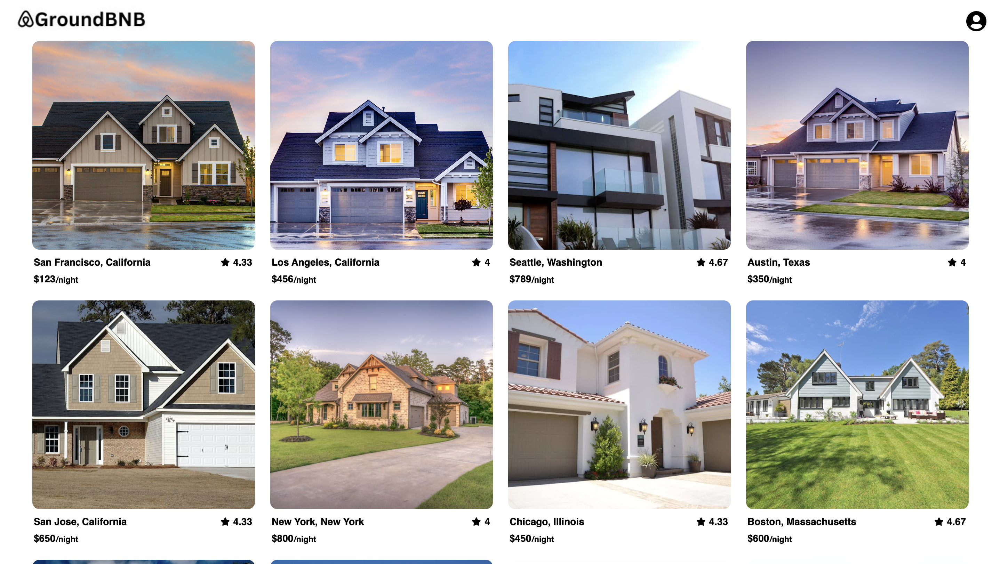
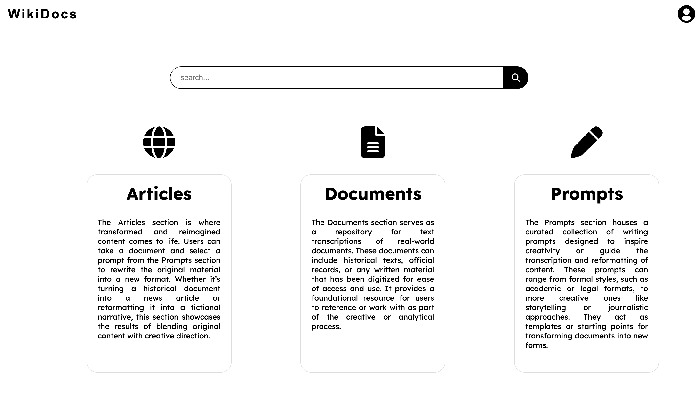
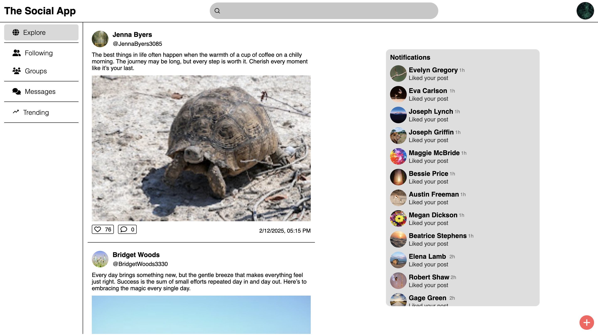

# Aaron Alvarado

**`Full-Stack Developer`**

[Portfolio](aaronalvd.us)

    
    

## About Me

Hello! I'm a passionate software developer with a strong foundation in full-stack development. I graduated from App Academy, where I underwent intensive training in modern web technologies, and I'm currently continuing my education at a college in California. With experience in building dynamic and user-friendly web applications, I’ve developed strong skills in problem-solving, teamwork, and effective communication. My background in mathematics enhances my analytical thinking, and I’m always eager to learn and adapt to new technologies. Feel free to explore my repositories and reach out if you’re interested in collaborating or discussing the latest in tech!

### Completed Projects

  
  <h3 style="margin: 10px 0 10px 0">GroundBnb</h3>
  
<a href="https://github.com/AaronAlvd/Ground-bnb" target="_blank">Github</a>

  
<a href="https://ground-bnb-n5l7.onrender.com/" target="_blank">Live Website</a>

  
  <h3 style="margin: 10px 0 10px 0">WikiDocs</h3>
  
<a href="" target="_blank">Github</a>

  
<a href="" target="_blank">Live Website</a>

### Projects In Progress

  
  <h3 style="margin: 10px 0 10px 0">Social App</h3>
  
<a href="https://github.com/AaronAlvd/SocialApp" target="_blank">Github</a>

  
<a href="https://socialapp-1-leom.onrender.com/" target="_blank">Live Website</a>

### 🌟 Achievements:
- Completed App Academy’s rigorous software development bootcamp, building several full-stack web applications.
- Gained practical experience with modern technologies like **React**, **Redux**, **Express**, **Sequelize**, and **PostgreSQL**.

### 🛠️ Technologies & Tools:

- **ExpressJS** 
- **Flask**
- **Google Drive API**
- **OpenAI API**
- **NodeJS**

  <!-- JavaScript Logo -->
  
  <!-- Python Logo -->
  
  <!-- HTML Logo -->
  
  <!-- CSS Logo -->
  
  <!-- Sequelize Logo -->
  
  <!-- React Logo -->
  
  <!-- Redux Logo -->
  
  <!-- PostgreSQL -->
  

